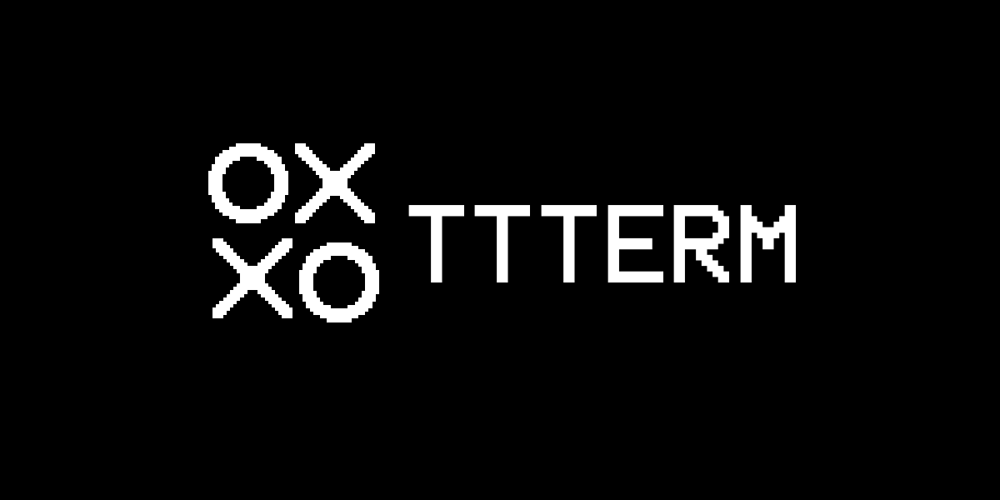

# TTTerm




Short for Tic-Tac-Terminal.

A full-fledged command-line based Tic-Tac-Toe game complete with rendered sprites, SFX, and difficulty-adjustable
AI opponents, built in C++.


## Installation

Download and extract one of the releases at the [Releases](https://github.com/a22Dv/ttterm/releases) section of this repository. 

## Getting Started

Go to the path where you extracted the release and run 
```
./ttterm
```
### Controls

Use `Arrow Keys` to navigate, `Enter` to select options.

## Features

- 240x120 display
- Gameplay SFX/BGM
- Cursor-based control
- Natively rendered sprites in the terminal using Braille  characters.

## License

This project is licensed under the MIT license - see LICENSE for more details.

## Author

a22Dv - a22dev.gl@gmail.com

